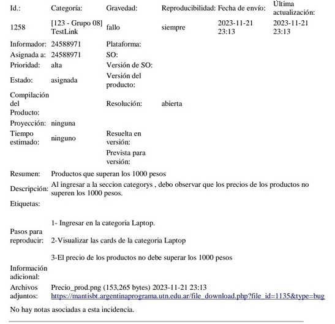

# QA Portfolio – E-commerce Testing (UTN Advanced Testing Project)

This repository showcases a structured QA process applied to a real e-commerce application, including planning, execution, defect management and performance validation.

---

## 📌 Project Overview

**Application Under Test:** https://www.demoblaze.com/  
**Project Type:** E-commerce Web Application  
**Testing Approach:** Manual Functional Testing + Performance & Accessibility Analysis  

This project involved the creation and execution of a formal Master Test Plan (MTP), manual test case design, defect reporting, and performance auditing.

---

## 📄 Scope of Testing

### 🛒 User Story 1 – Product Listing Validation

Validated acceptance criteria:
- Application language must be English
- Prices must be displayed in pesos
- No product price should exceed 1000 pesos
- Text color must be black
- Only products with stock should be displayed

### 📦 User Story 2 – Product Detail Validation

Validated acceptance criteria:
- Product name, price, image and description displayed
- Final price must include taxes
- Each product must have at least two images
- Response time must not exceed 200 ms

---

## 🧪 Testing Activities Performed

✔ Requirements loaded into TestLink  
✔ 9 manual test cases designed and executed  
✔ 100% test execution rate achieved  
✔ 1 functional defect reported in MantisBT  
✔ Performance validation using Chrome DevTools (Network tab)  
✔ Lighthouse audit for Performance & Accessibility  

---

## 🐞 Defect Identified

**Issue:** Products exceeding the defined 1000 pesos price limit  
**Severity:** High  
**Tool Used:** MantisBT  

---

## ⚡ Performance & Accessibility Findings

- Average observed response time: **210 ms**
- Performance improvement opportunities detected
- Missing ALT attributes in images
- Accessibility issues in links
- High Best Practices score in Lighthouse

---

## 📸 Testing Evidence

### 🐞 Defect Report (MantisBT)

---

### ⚡ Lighthouse Audit

---

### 🌐 Network Analysis (Chrome DevTools)

---

## 🛠 Tools & Technologies

- TestLink
- MantisBT
- Chrome DevTools
- Lighthouse
- Manual Testing
- Acceptance Criteria Validation

---

## 📊 Key Results

- 9 Test Cases Designed
- 1 Functional Defect Detected
- 210 ms Average Response Time Measured
- 2 User Stories Fully Validated
- Formal Master Test Plan Developed

---

## 🎯 Skills Demonstrated

- Master Test Plan creation
- Requirements analysis
- Acceptance criteria validation
- Manual test case design
- Functional testing
- GUI testing
- Performance validation
- Defect lifecycle management
- Structured QA documentation

---

## 👤 Author

**Alberto Alejandro Pedraza**  
QA Engineer (Junior)
---

## 📫 Contact

🔗 LinkedIn:
https://www.linkedin.com/in/alberto-alejandro-pedraza/
